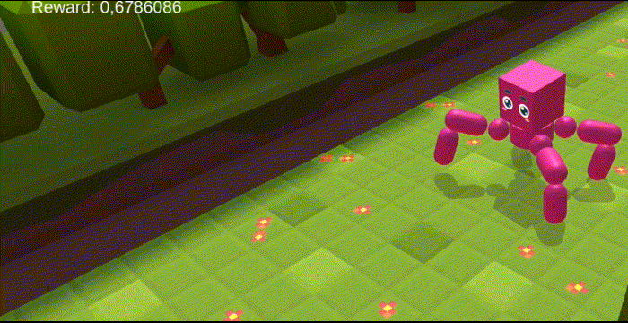
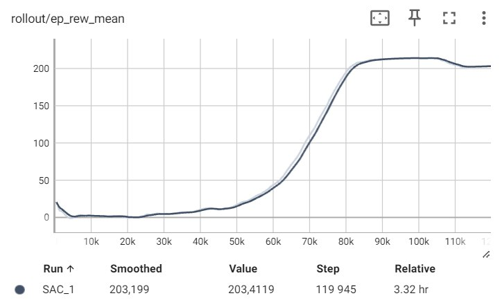

# Pipeline for training MLAgents environments using Kaggle Notebooks
A custom environment was created for the project in Unity using MLAgents. Next, the environment was trained using reinforcement learning algorithms in Kaggle Notebook using Stable Baselines3. At the moment, I have not found other examples on the Internet where it would be possible to combine these frameworks and runtimes.

## Why this combination?

Unity MLAgents makes it easy to create your own reinforcement learning environments and has connections to Python and Gym to standardize the environment.

The main advantage of the Kaggle core is the ability to work in the background for quite a long time for free (compared to Colab). This allows you not to use your own computer for rather lengthy calculations.

Stable Baselines provides state-of-the-art, robust reinforcement learning methods, as well as easy tracking of experiments in Tensorboard.

## Enviroment and results

My own environment was used, created in Unity using Ariticulation Body (allows you to achieve realism in joints and actuators for robotics).
The environment is a spider with 8 degrees of freedom. A reward is given for each step in proportion to the speed in the desired direction with a shift (negative reward for standing still). More details about the environment will be written in another repository.
The Soft Aсtor-Critic algorithm from Stable Baselines 3 taught a spider to walk in 100,000 steps.

## Tensorboard Visualization

To visualize the results, you can use Google Colab by loading the resulting tensorboard archive into the content folder and calling the console commands:

'''
!unzip ./sac_spyder_tensorboard.zip
%load_ext tensorboard
%tensorboard --logdir /content/kaggle/working/sac_spyder_tensorboard
'''
